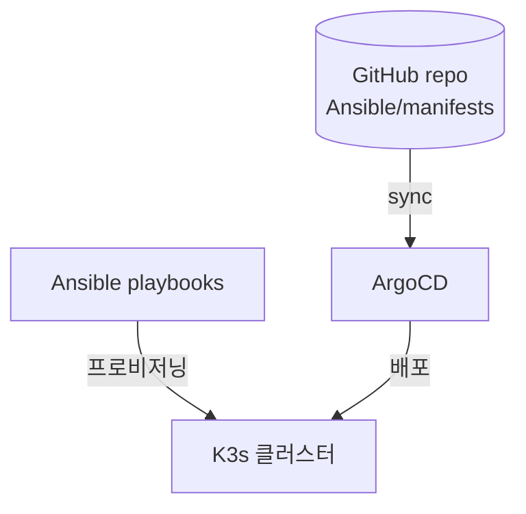
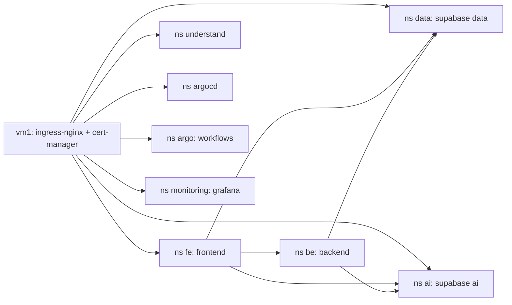

# Ansible — 인프라 & Kubernetes 구조

KakaoCloud VM 5대로 **K3s** 클러스터를 Ansible로 프로비저닝하고, 그 위 워크로드는 **ArgoCD(GitOps)**
로 배포한다. 이 문서는 클러스터 구조·노드 배치·네임스페이스/서비스·네트워킹·스토리지를 정리한다.



- **Ansible 역할**: K3s 설치/조인, 공통 설정, Longhorn 사전준비 (`playbooks/`).
- **ArgoCD 역할**: `Ansible/manifests/`(+ 외부 Helm 차트)를 클러스터에 동기화. Git이 단일 진실원.

---

## 1. 노드 토폴로지 & 워크로드 라벨

| 노드 | inventory 그룹 | Private IP | 역할 | 워크로드 라벨 |
|---|---|---|---|---|
| vm1 | masters / bastion | 10.1.1.10 (Public 210.109.83.10) | Control Plane + Ingress + NAT | (control plane) |
| vm2 | workers | 10.1.3.10 | 앱 워커 | `workload=app` |
| vm3 | workers | 10.1.4.10 | 앱 워커 | `workload=app` |
| vm4 | workers | 10.1.5.10 | 데이터/DB | `workload=data` |
| vm5 | gpu | 10.1.7.10 | GPU/AI (Tesla T4) | `workload=gpu` |

> 워크로드는 `nodeSelector`로 노드에 고정: **app**(FE/BE) → vm2/vm3, **data**(Supabase data) → vm4,
> **gpu**(Supabase ai + ML/KServe) → vm5. (라벨 종류: app×5, data×7, gpu×14 사용처)

---

## 2. ArgoCD 애플리케이션 (GitOps 단위)

`manifests/argocd/` — App-of-Apps 형태로 8개 앱을 정의. 모두 `repoURL = 이 레포(main)`.

| App | 대상 ns | 소스 | 종류 |
|---|---|---|---|
| `4k-fe` | `fe` | `Ansible/manifests/4k-fe` | Kustomize (자체 매니페스트) |
| `4k-be` | `be` | `Ansible/manifests/4k-be` | Kustomize |
| `4k-ml` | `ai` | `Ansible/manifests/4k-ml` | Kustomize (Workflow/KServe) |
| `understand-dashboard` | `understand` | `Ansible/manifests/understand` | Kustomize |
| `infra-manifests` | `default` | `Ansible/manifests/apps` | Kustomize (ClusterIssuer·Ingress·RBAC) |
| `supabase-data` | `data` | Helm `supabase` 0.5.6 + `values/values-data.yaml` | Helm |
| `supabase-ai` | `ai` | Helm `supabase` 0.5.6 + `values/values-ai.yaml` | Helm |
| `argo-workflows` | `argo` | Helm `argo-workflows` 1.0.14 + values | Helm |

> 모니터링(Prometheus/Grafana/Loki/Promtail)·ingress-nginx·cert-manager·Longhorn은 Helm/매니페스트로
> 설치(values는 `values/`·`helm-values/`). CI가 `4k-*` kustomization 태그를 bump하면 ArgoCD가 자동 롤아웃.

---

## 3. 네임스페이스 & 서비스



| 네임스페이스 | 워크로드 | 서비스 노출 |
|---|---|---|
| `fe` | `frontend` Deployment + HPA(2~10) | Service `80→3000`, Ingress `peakly.art`·`www.peakly.art` |
| `be` | `backend` Deployment + HPA(1~4) + CronJob(자막/backfill) | Service `8000→8000` (내부) |
| `data` | Supabase(Postgres+pgvector·PostgREST·Kong·Studio) | Ingress `data.peakly.art` |
| `ai` | Supabase ai + ML(Workflow·InferenceService) | Ingress `ai.peakly.art` |
| `understand` | 정적 대시보드 | Service `80→80`, Ingress `understand.peakly.art` |
| `argo` | Argo Workflows controller·server | Ingress `workflows.peakly.art` |
| `argocd` | ArgoCD | Ingress `argocd.peakly.art` |
| `monitoring` | Prometheus·Grafana·Loki·Promtail | Ingress `grafana.peakly.art` |
| `default` | infra-manifests(ClusterIssuer·Ingress·RBAC) | — |

---

## 4. 앱별 매니페스트 (`manifests/`)

### `4k-fe/` (ns fe)
- `deployment.yaml` — frontend(`nodeSelector workload=app`), env(MANAGER_*·AI_DATABASE_*·AGAMI_SECRET 등 secretKeyRef)
- `service.yaml`(80→3000) · `hpa.yaml`(min 2 / max 10 / CPU 70%)
- `ingress.yaml`(`peakly.art`,`www`) · `ingress-ratelimit.yaml`(`/api/visit` 등 rate limit)
- `kustomization.yaml`(이미지 newTag = CI가 갱신)

### `4k-be/` (ns be)
- `deployment.yaml`(`workload=app`) · `service.yaml`(8000) · `hpa.yaml`(min 1 / max 4 / 70%)
- `networkpolicy.yaml` — be 파드 인그레스를 특정 ns에서만 허용(네임스페이스 셀렉터)
- `subtitle-cronjob.yaml`(자막 수집, KST 03:00) · `backfill-cronjob.yaml`(인기작, KST 04:00)

### `4k-ml/` (ns ai)
- `inferenceservice-roberta-va.yaml` — KServe 서빙(`workload=gpu`=vm5, ml-models PVC `/mnt/models`)
- `workflowtemplate-*.yaml` — subtitle-parse / llm-labeling / train-roberta(-seq) / score-scenes(-gpu) / generate-vectors
- `cronworkflow-parse|score|vector.yaml` — 일 1회 배치(05/06/07시 KST) · `pvc-models.yaml`

### `understand/` (ns understand)
- `deployment`·`service`(80)·`ingress`(understand.peakly.art) — 정적 지식그래프 대시보드(nginx)

### `apps/` (infra-manifests, ns default)
- `cluster-issuer.yaml` — cert-manager Let's Encrypt ClusterIssuer
- `ingress-nginx-config.yaml` — ingress-nginx ConfigMap(공통 설정)
- `ingress-studio.yaml` — Supabase data/ai Studio Ingress(Basic Auth)
- `argo-workflows-ingress.yaml` — workflows.peakly.art · `argo-workflow-rbac-ai.yaml` — ai ns ServiceAccount/RBAC

---

## 5. 외부 Helm 릴리스 (values)

| 릴리스 | 차트 | values | 노드 |
|---|---|---|---|
| supabase-data | supabase 0.5.6 | `values/values-data.yaml` | `workload=data`(vm4) |
| supabase-ai | supabase 0.5.6 | `values/values-ai.yaml` | `workload=gpu`(vm5) |
| argo-workflows | argo-workflows 1.0.14 | `values/values-argo-workflows.yaml` | — |
| argocd | (부트스트랩) | `values/values-argocd.yaml` | — |
| 모니터링 | kube-prometheus-stack / loki / promtail | `values/values-prometheus.yaml`·`values-loki.yaml`·`values-promtail.yaml` | — |
| ingress-nginx / longhorn | — | `helm-values/ingress-nginx.yaml`·`longhorn.yaml` | — |

> `values-data.yaml`의 `PGRST_DB_POOL` 등 일부 변경은 ArgoCD 미관리분이라 수동 `helm upgrade`로 적용(부하테스트 참조).

---

## 6. 네트워킹 · TLS · 보안

- **Ingress**: ingress-nginx(vm1) 단일 진입점. 호스트 라우팅:
  `peakly.art`/`www`→fe · `data`→supabase data · `ai`→supabase ai · `understand` · `grafana` · `argocd` · `workflows`.
- **TLS**: cert-manager + Let's Encrypt(`cluster-issuer.yaml`) 자동 발급.
- **Rate limit**: `4k-fe/ingress-ratelimit.yaml`(`/api/visit` 비콘 스팸 차단).
- **NetworkPolicy**: `4k-be/networkpolicy.yaml` — backend 인그레스를 허용된 ns로 제한(k3s kube-router 적용).
- **Secret**: 앱 시크릿은 클러스터 Secret(`frontend-secrets` 등)에서 `secretKeyRef`로 주입(평문 매니페스트 금지).

---

## 7. 스토리지

- **Longhorn** (`helm-values/longhorn.yaml`, 사전준비 `playbooks/04-longhorn-prereq.yml`) — 분산 블록 스토리지.
- **local-path** — `ml-models` PVC(`4k-ml/pvc-models.yaml`)는 vm5 로컬 경로(모델 아티팩트, KServe 마운트).

---

## 8. Ansible 파일 구성

| 경로 | 역할 |
|---|---|
| `inventory.ini` | 노드 인벤토리(masters/workers/gpu/bastion 그룹) |
| `ansible.cfg`·`ssh_config`·`group_vars/` | 접속/공통 변수 |
| `playbooks/00-ping` → `01-common` → `02-k3s-server` → `03-k3s-agent` → `04-longhorn-prereq` | 프로비저닝 순서 |
| `manifests/` | **ArgoCD가 동기화하는 K8s 매니페스트(GitOps 소스)** |
| `values/`·`helm-values/` | Helm 차트 values |
| `kubeconfig`·`k3s_node_token` | 클러스터 접근/조인 토큰(gitignore 권장) |
| `generate-apply-secrets` | 시크릿 생성/적용 스크립트 |

### 부트스트랩 순서 (요약)
```
1) ansible-playbook playbooks/02-k3s-server.yml   # vm1 control plane
2) ansible-playbook playbooks/03-k3s-agent.yml    # vm2~5 조인 + 노드 라벨(workload)
3) playbooks/04-longhorn-prereq.yml + Longhorn 설치
4) ingress-nginx / cert-manager / ArgoCD 설치
5) ArgoCD에 manifests/argocd/* 적용 → 나머지 앱 자동 동기화
```

---

## 빠른 확인

```bash
export KUBECONFIG=$(pwd)/kubeconfig
kubectl get nodes -o wide --show-labels | grep workload   # 노드 라벨 확인
kubectl get applications -n argocd                         # ArgoCD 앱 동기화
kubectl get pods -A
kubectl get ingress -A                                     # 호스트 라우팅
```

> 상세 운영/CI-CD는 루트 [`docs/devops.md`](../docs/devops.md), ML은 [`docs/mlops.md`](../docs/mlops.md) 참고.
