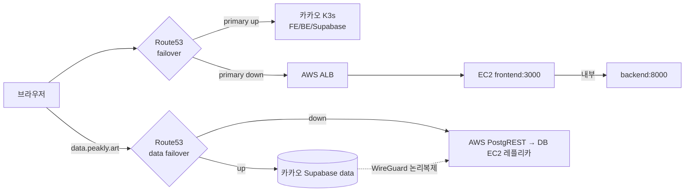
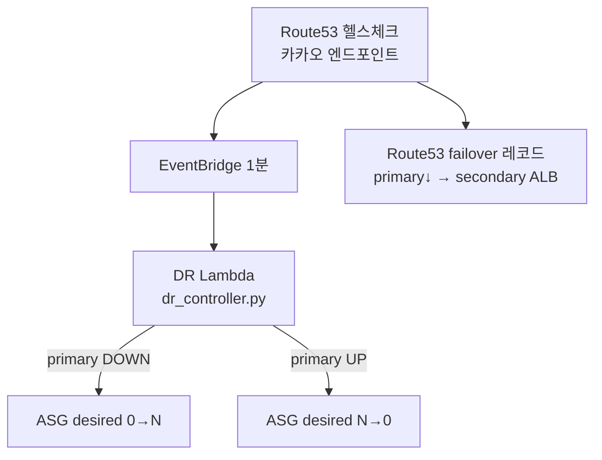

# AWS DR 전략 (재해 복구)

> **한 줄 요약:** 카카오클라우드(Primary)가 **전체 장애**일 때만 Route53가 트래픽을 AWS(Secondary)로
> 넘기는 **콜드 스탠바이 DR**. 평상시 비용은 최소(앱 0대), 카카오와 동일 이미지/시크릿으로 동작.

## 목차
- [1. DR 전략 개요](#1-dr-전략-개요)
- [2. 아키텍처](#2-아키텍처)
- [3. 페일오버 자동화 & 장애~복구 시나리오](#3-페일오버-자동화--장애복구-시나리오)
- [4. 설계 결정 로그 (왜 이렇게)](#4-설계-결정-로그-왜-이렇게)
- [5. 구현 — Terraform 인프라](#5-구현--terraform-인프라)
- [6. 구현 — 앱 티어 (docker compose)](#6-구현--앱-티어-docker-compose)
- [7. 구현 — DB 복제/승격 런북](#7-구현--db-복제승격-런북)
- [8. 비용 최적화](#8-비용-최적화)
- [9. 운영 메모 & Game Day 체크리스트](#9-운영-메모--game-day-체크리스트)

---

## 1. DR 전략 개요

### 목표 & 원칙
| 원칙 | 내용 |
|---|---|
| **DR-only (failover)** | "부하 분담(burst)"은 채택 안 함. Route53는 부하 LB가 불가(DNS 캐시+up/down)하고 "카카오 우선"과 충돌. 과부하는 **카카오 내부에서 흡수(K3s 확장)**. |
| **카카오 우선** | 평상시 모든 트래픽은 카카오. AWS는 **카카오 전체 장애 시에만** 활성. |
| **콜드 스탠바이** | 앱 ASG는 평상시 **0대**(비용~0). 장애 시 0→N 자동 부팅. |
| **단일 writer** | 평상시 쓰기는 카카오 DB 1곳(split-brain 방지). DR 시에만 AWS 레플리카로 승격. |
| **패리티** | 카카오와 **동일 GHCR 이미지 + 동일 시크릿(JWT/세션)** — 전환해도 세션·키가 그대로 검증. |
| **비용 최소** | NAT 제거 + DB 다운사이즈로 상시 ~$49/월(8절). |

### RTO / RPO (목표·추정 — Game Day로 실측 권장)
| 지표 | 값(추정) | 결정 요인 |
|---|---|---|
| **RTO**(복구 시간) | **수 분** | 헬스체크 감지(EventBridge 1분) + Lambda ASG 0→N + EC2 콜드 부팅·compose up + DNS TTL 전파 |
| **RPO**(데이터 손실) | **수 초** | 논리복제 lag(평상시 수 초). 페일오버 순간 미복제 행 손실 가능. **DDL·시퀀스·함수는 비복제**(수동) |

### 페일오버 범위 (무엇이 / 어떻게)
| 구성요소 | Primary(카카오) | Secondary(AWS) | 전환 방식 |
|---|---|---|---|
| FE/BE 앱 | K3s Deployment+HPA | EC2 docker compose(콜드 ASG) | Route53 `peakly.art` failover + DR Lambda가 ASG 기동 |
| 서비스 DB | Supabase `data`(writer) | DB EC2 Postgres+PostgREST(레플리카) | Route53 `data.peakly.art` failover + 수동 승격(7절) |
| DNS | Route53 failover 레코드 | — | primary 헬스체크 down → secondary로 |
| AI/ML·cron | 카카오 전용 | **DR 범위 밖** | 장애 시 미제공(핵심 서비스만 복구) |

---

## 2. 아키텍처



- 앱: 카카오와 **동일 GHCR 이미지**(`4k-fe`/`4k-be`)를 EC2 docker compose로 stateless 구동.
- DB: 카카오 `data` → AWS DB EC2(Postgres+pgvector+PostgREST)로 **WireGuard 논리복제**.
- 리전: 서울(`ap-northeast-2`, 복제지연 최소). CIDR: AWS `10.20.0.0/16` ↔ 카카오 `10.1.0.0/16`(비충돌).

| 서비스 | 이미지 | 포트 | 공개 |
|---|---|---|---|
| frontend | `ghcr.io/sanggyoon/4k-fe` | 3000 | ALB 타깃 ✅ |
| backend | `ghcr.io/sanggyoon/4k-be` | 8000 | 내부망만 ❌ |

---

## 3. 페일오버 자동화 & 장애~복구 시나리오

### 자동화 흐름

- **앱 전환은 자동**: 헬스체크 down → Lambda가 ASG를 0→N으로 올려 EC2 부팅, 동시에 DNS가 ALB로 스윙.
- **DB 승격은 수동**(7e): split-brain 위험이 커 사람이 판단(구독 중지 + 시퀀스 전진).

### 시나리오
| 단계 | 상태 | 동작 |
|---|---|---|
| ① 평상시 | 카카오 정상 | 모든 트래픽 카카오. AWS 앱 0대, DB EC2만 상시(복제 수신). |
| ② 장애 감지 | 카카오 down | Route53 헬스체크 fail(EventBridge 1분 주기). |
| ③ 앱 페일오버 | 자동 | DR Lambda ASG 0→N, DNS `peakly.art`→ALB. EC2 부팅 후 `:3000` 서빙. |
| ④ DB 승격 | **수동** | `ALTER SUBSCRIPTION ... DISABLE` + 시퀀스 전진 → 레플리카 읽기·쓰기. `data.peakly.art`→AWS PostgREST. |
| ⑤ DR 운영 | AWS 서빙 | 핵심 서비스(FE/BE/DB) 제공. ML/cron은 미제공. |
| ⑥ 카카오 복구 | 복구 | 역동기화(쓰기 동결 점검창) → DNS primary 자동 복귀 → AWS 앱 N→0, 구독 재활성화. |

> ⑥ failback(역동기화)이 가장 위험한 구간 → 7e 절차로 신중히.

---

## 4. 설계 결정 로그 (왜 이렇게)

| 결정 | 이유 | 대안/트레이드오프 |
|---|---|---|
| **DR-only(부하분담 X)** | Route53 부하 LB 불가 + 카카오 우선 충돌 | burst는 카카오 K3s 내부 확장으로 흡수 |
| **콜드 ASG(0대)** | 평상시 비용 최소 | RTO에 콜드 부팅 시간 추가(수 분) |
| **단일 writer(평상시 카카오)** | split-brain 방지 | DR 시에만 승격 |
| **NAT 제거 + public+엄격 SG** | 상시 ~$46/월 절감 | SG 오설정 폭발반경↑(8절) |
| **WireGuard 논리복제** | Postgres 공인 노출 회피, 테이블 2개만 | DDL/시퀀스/함수 수동(7절) |
| **동일 이미지/시크릿** | 전환 후 세션·키 무효화 방지 | env 패리티 관리 필요(6절) |

---

## 5. 구현 — Terraform 인프라

`aws/terraform/` — 관심사별 파일로 분리한 단일 루트 평면 구성.

### 진행 상태
- [x] 3a 네트워크(VPC·2AZ·서브넷·IGW·라우팅) / 3b SG(alb·app·bastion)
- [x] 3c ALB(ACM DNS검증 + HTTPS:443 + HTTP→HTTPS + TG:3000)
- [x] 3d 앱 컴퓨트(IAM·LT·user_data) + ASG(콜드 0/0/4) + DR 트리거
- [x] 4 Route53 failover(peakly.art/www = primary 카카오 / secondary ALB)
- [x] 5a DB 레플리카 EC2(+EBS·db SG·IAM) / 5d data.peakly.art failover + PostgREST host 라우팅
- [ ] 3e Bastion(선택 — SSM 대체) / 5b~5e WireGuard·논리복제·승격(→ 7절 운영)

### 파일
| 파일 | 내용 |
|---|---|
| `versions.tf`/`providers.tf`/`variables.tf` | 버전·provider·입력값(region/cidr/azs) |
| `network.tf` | VPC·서브넷·IGW·(NAT 제거됨)·라우팅 |
| `security.tf` | 보안그룹(alb/app/bastion) |
| `alb.tf` | Route53 zone 참조, ACM(DNS검증), ALB·TG·리스너 |
| `iam.tf` | 앱 EC2 IAM(SSM + Param 읽기) |
| `compute.tf`/`asg.tf` | AL2023 LT / 콜드 ASG(desired는 DR Lambda 조정) |
| `dr_trigger.tf` + `lambda/dr_controller.py` | Route53 헬스체크 + Lambda + EventBridge(1분) → ASG 0↔N |
| `dns.tf` | 앱 + data 도메인 failover 레코드 |
| `db.tf`/`postgrest.tf` | DB 레플리카 EC2·EBS·db SG(5a) / PostgREST TG·ALB host(5d) |
| `user_data.sh.tftpl`/`user_data_db.sh.tftpl` | EC2 부트스트랩 |
| `outputs.tf` | vpc_id, subnet ids, ALB DNS/zone, TG ARN, db_public_ip |

### 시크릿(SSM) & 사용
```bash
cd aws/terraform
cp ssm-params.sh.example ssm-params.sh && vi ssm-params.sh   # 카카오와 동일 값, gitignore됨
bash ssm-params.sh                                           # /peakly/dr/* 등록 (user_data가 .env 생성)
cp terraform.tfvars.example terraform.tfvars
export AWS_PROFILE=peakly
terraform init && terraform validate && terraform plan && terraform apply
terraform output     # 정리: terraform destroy
```
> state는 로컬 파일. 지속 운영 시 `versions.tf` S3 backend로 migrate 권장.

---

## 6. 구현 — 앱 티어 (docker compose)

`aws/docker-compose.yml` — frontend + backend (DB는 별도 EC2).
```bash
echo $GHCR_PAT | docker login ghcr.io -u <user> --password-stdin   # private면(현재 public이면 생략)
cp .env.example .env && vi .env
docker compose up -d && docker compose ps && curl -I http://localhost:3000/
```

### ⚠️ env 패리티 (failover가 깨지지 않으려면 필수)
카카오 시크릿과 **같은 값**:
- `MANAGER_SESSION_SECRET` — 다르면 failover 후 로그인 세션 전부 무효화
- `DATA_SUPABASE_KEY`(service_role) + anon 키의 **JWT secret** — 레플리카 PostgREST가 동일 secret이어야 키 검증
- `MANAGER_ID`/`MANAGER_PASSWORD`, `TMDB_API_KEY`

### `DATA_SUPABASE_URL`
| 상황 | 값 | 결과 |
|---|---|---|
| 평상시 | `https://data.peakly.art` | Route53 primary → 카카오(단일 writer) |
| DR | 동일(failover) 또는 로컬 PostgREST | EC2 레플리카(7e 승격) |

> backend는 `expose`만(미공개). 안정 운영 시 `:latest` 대신 `:<sha7>` 핀.

---

## 7. 구현 — DB 복제/승격 런북

카카오 `data`를 AWS DB EC2로 **논리복제**(WireGuard) 후 장애 시 승격. 인프라는 `db.tf`.

> ⚠️ 논리복제 한계: **DDL·함수·시퀀스·확장 비복제.** 스키마/pgvector/RPC/롤은 레플리카에 1회 수동 생성, 변경 시 양쪽 반영. **데이터(행)만 복제.**

### 7b. WireGuard 터널 (vm1 ↔ AWS DB EC2)
```ini
# AWS DB EC2 /etc/wireguard/wg0.conf
[Interface]
Address = 10.99.0.2/24
ListenPort = 51820
PrivateKey = <AWS_PRIVATE_KEY>
[Peer]                       # 카카오 vm1
PublicKey = <VM1_PUBLIC_KEY>
Endpoint = 210.109.83.10:51820
AllowedIPs = 10.99.0.1/32
PersistentKeepalive = 25
```
```ini
# 카카오 vm1 /etc/wireguard/wg0.conf
[Interface]
Address = 10.99.0.1/24
ListenPort = 51820
PrivateKey = <VM1_PRIVATE_KEY>
[Peer]                       # AWS DB EC2 (NAT 뒤 → endpoint 생략)
PublicKey = <AWS_PUBLIC_KEY>
AllowedIPs = 10.99.0.2/32
```
```bash
systemctl enable --now wg-quick@wg0   # 양쪽 → wg 로 handshake 확인
```
> AWS가 NAT 뒤라 **AWS쪽 Endpoint+keepalive**로 터널 유지. db SG는 51820/udp를 카카오 IP에서만 허용.

### 7c. 논리 복제
```sql
-- (1) 카카오 publisher
ALTER SYSTEM SET wal_level = logical;   -- + max_replication_slots/max_wal_senders, 재시작
CREATE ROLE repl WITH REPLICATION LOGIN PASSWORD '<강한비번>';
GRANT USAGE ON SCHEMA public TO repl; GRANT SELECT ON ALL TABLES IN SCHEMA public TO repl;
CREATE PUBLICATION peakly_pub FOR TABLE public.movies, public.movie_vectors;
-- pg_hba: host all repl 10.99.0.2/32 scram-sha-256 ; vm1에서 NodePort(예 30432)로 노출
```
```sql
-- (2) AWS subscriber (pgvector/pgvector:pg16 컨테이너 + 스키마/확장/RPC/롤 1회 생성)
--   pg_dump --schema-only -t movies -t movie_vectors -n public <카카오> > schema.sql
CREATE SUBSCRIPTION peakly_sub
  CONNECTION 'host=10.99.0.1 port=30432 dbname=postgres user=repl password=<비번> sslmode=disable'
  PUBLICATION peakly_pub;
SELECT * FROM pg_stat_subscription;   -- 상태/행수 비교
```

### 7d. AWS PostgREST + data.peakly.art failover
```yaml
postgrest:
  image: postgrest/postgrest:v12.2.3
  environment:
    PGRST_DB_URI: "postgres://authenticator@db:5432/postgres"
    PGRST_DB_SCHEMAS: "public"
    PGRST_DB_ANON_ROLE: "anon"
    PGRST_JWT_SECRET: "<카카오와 동일>"   # SSM /peakly/dr/db/JWT_SECRET
  ports: ["3000:3000"]
```
Terraform 완료: ALB host `data.peakly.art → PostgREST TG` + data failover 레코드(primary 카카오 Kong / secondary ALB).

### 7e. 승격(수동) + 역동기화(failback)
```sql
-- 장애 시 승격 (레플리카는 이미 쓰기 가능 → 가벼움)
ALTER SUBSCRIPTION peakly_sub DISABLE;
SELECT setval('movies_id_seq', (SELECT max(id) FROM movies));   -- 시퀀스 전진(PK 충돌 방지)
```
- **카카오 복구 후 역동기화**(split-brain 위험 최대 → 쓰기 동결 점검창):
  소규모는 `pg_dump` 변경분 UPSERT, 확실히는 AWS→카카오 임시 역방향 복제 후 컷오버 → `ALTER SUBSCRIPTION peakly_sub ENABLE;`

---

## 8. 비용 최적화

상시 **~$110 → ~$49/월(약 55%↓)**. (서울 온디맨드 근사치)

| 변경 | 효과 |
|---|---|
| DB EC2 `t3.medium → t3.small` | -$19/월 |
| NAT Gateway + EIP 제거(앱·DB를 public+공인IP) | -$46/월 |

| 항목 | Before | After |
|---|---|---|
| NAT+EIP | ~$46.6 | 제거 |
| ALB+IPv4×2 | ~$23 | ~$23 |
| DB EC2 | t3.medium ~$38 | t3.small ~$19 |
| DB 공인 IPv4 | — | +~$3.6 |
| EBS 30GB | ~$3 | ~$3 |
| 앱 ASG(콜드) | $0 | $0 |
| **상시 합계** | **~$110** | **~$49** |

**보안 트레이드오프:** public+공인IP라도 인바운드는 SG로 최소화(앱:3000←ALB만 / DB:5432←app·51820←카카오IP만),
SSH 미오픈(SSM), IMDSv2 강제. 단 **SG 오설정 폭발반경↑** — `admin_cidrs`는 본인 IP/32로. 민감도 높으면 NAT 복원이 정석.

**NAT 복원:** `network.tf`에 EIP+NAT GW+private RT 복원 → `asg.tf`/`compute.tf`/`db.tf` private 전환 → apply(월 ~$46↑).
**더 줄이기:** DB t4g.small(ARM) / ALB 제거→Caddy(failover 안정성↓) / 단일 EC2 통합 / DB Savings Plan.

---

## 9. 운영 메모 & Game Day 체크리스트

### 운영 메모
- 카카오 방화벽/SG에서 **DB EC2 공인 IP의 WireGuard(51820/udp)** 허용. `terraform output db_public_ip`로 확인
  (인스턴스 교체 시 변동 → 고정하려면 `aws_eip`+association).
- NAT 제거로 NAT 데이터요금은 사라지나 공인 IP 아웃바운드는 표준 전송요금(복제는 WG 경유).

### Game Day 체크리스트
- [ ] WireGuard handshake + ping OK
- [ ] 카카오 publication + repl 롤 + NodePort 노출
- [ ] 레플리카 스키마/pgvector/RPC/롤 생성
- [ ] subscription LIVE, 행수 일치, lag 낮음
- [ ] PostgREST(JWT 동일) 200 응답
- [ ] data.peakly.art failover 레코드(Terraform)
- [ ] **앱 페일오버 리허설**: 헬스체크 강제 fail → ASG 0→N + DNS 스윙 + RTO 실측
- [ ] **DB 승격/역동기화 1회 리허설** + RPO 실측
