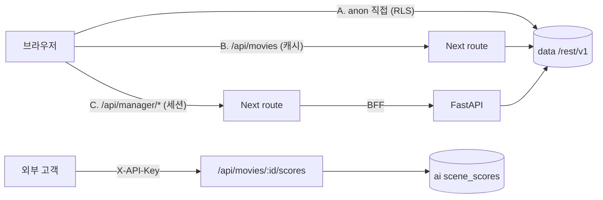
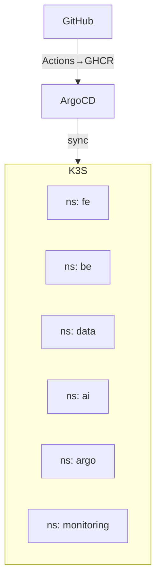

# 시스템 아키텍처 (Peakly)

Peakly의 전체 시스템 구조 — 클라이언트부터 인프라까지. 세부는 각 문서 참고:
[API](api.md) · [ML 파이프라인](ml-pipeline.md) · [MLOps](mlops.md) · [DevOps](devops.md).

## 1. 전체 구성도

```mermaid
flowchart TB
  subgraph CLIENT[클라이언트]
    BROWSER[브라우저]
    CUST[외부 고객 서버]
  end

  subgraph EDGE[엣지 · vm1]
    ING[ingress-nginx + TLS\n(cert-manager / Let's Encrypt)]
  end

  subgraph APP[애플리케이션]
    FE["Next.js (4K_FE)\npage + route handler(BFF)"]
    BE["FastAPI (4K_BE)"]
    UND[understand 대시보드]
  end

  subgraph DATA[데이터]
    DDB[("Supabase data\nmovies·movie_vectors·api_keys")]
    ADB[("Supabase ai\nscene_scores·model_versions")]
  end

  subgraph ML[ML / MLOps]
    ARGO[Argo Workflows\nCronWorkflows]
    KSERVE[KServe: roberta-va]
    PVC[(ml-models PVC · vm5)]
  end

  BROWSER --> ING
  CUST -->|X-API-Key| ING
  ING --> FE
  ING --> UND
  BROWSER -. anon+RLS 직접 .-> DDB
  FE -->|BFF 프록시| BE
  FE -->|server, service key| ADB
  FE --> DDB
  BE --> DDB
  BE --> ADB
  ARGO --> KSERVE
  KSERVE --> PVC
  ARGO --> ADB
  ARGO --> DDB
```

## 2. 레이어

| 레이어 | 구성 | 책임 |
|---|---|---|
| **클라이언트** | 브라우저, 외부 고객 서버 | UI 소비 / 점수 API 소비(X-API-Key) |
| **엣지** | ingress-nginx(vm1) + cert-manager | 진입점, TLS 종료, rate limit |
| **프론트/BFF** | Next.js(`4K_FE`) — page + route handler | UI 렌더(SSR/CSR) + 서버 계층(캐싱·인증·프록시) |
| **백엔드** | FastAPI(`4K_BE`) | 매니저 작업, TMDB 보강, 자막/backfill, 통계 |
| **데이터** | Supabase data·ai(PostgreSQL+pgvector+PostgREST+Kong) | 서비스/AI 데이터, RLS |
| **ML/MLOps** | Argo Workflows, KServe, ml-models PVC | 파이프라인 오케스트레이션·모델 서빙 |
| **플랫폼** | K3s(5 VM), ArgoCD, Ansible, 모니터링 | 오케스트레이션·GitOps·IaC·관측 |

## 3. 요청/데이터 흐름 (4경로)



- **A** 공개 읽기(영화 상세·보강) → anon 키로 PostgREST 직접, RLS로 행 통제.
- **B** 메인 목록 → Next 서버가 `unstable_cache`로 캐싱 후 반환.
- **C** 매니저/쓰기 → 세션 인증 후 FastAPI 경유.
- **D**(외부) 점수 API → API 키 인증 후 ai DB(`aiDb.ts`, service 키).

## 4. ML 데이터 생성 흐름 (배치)

```mermaid
flowchart LR
  SRT[자막] --> PARSE[parse] --> SCORE[score\n(KServe)] --> VEC[vectors]
  SCORE --> SS[(scene_scores)]
  VEC --> MV[(movie_vectors)]
  SS --> APISCORE[점수 API·그래프]
  MV --> REC[추천 RPC]
```

일일 체인(KST): 03:00 자막수집 → 04:00 backfill → 05:00 parse → 06:00 score → 07:00 vector. → [MLOps](mlops.md)

## 5. 배포 토폴로지



- **5 VM**: vm1(control+ingress), vm2/3(FE/BE), vm4(data DB), vm5(GPU/AI + ml-models PVC).
- **GitOps**: Git 단일 진실원 → ArgoCD 앱 8개 동기화. → [DevOps](devops.md)

## 6. 횡단 관심사

| 관심사 | 방식 |
|---|---|
| **보안** | RLS(anon 최소 권한), 매니저 fail-closed 세션 인증 + agami CAPTCHA(비차단), rate limit, service 키 서버 격리 |
| **성능/캐싱** | Next.js Data Cache(`/api/movies` revalidate 3600) + `unstable_cache`(점수 등). 별도 Redis 미사용 |
| **관측성** | Prometheus/Grafana(메트릭), Loki/Promtail(로그) |
| **TLS** | cert-manager + Let's Encrypt |
| **복원력** | 맥미니 단독 백업(`backup/macmini-migration`), AWS DR 청사진(`aws/`) |

## 7. 기술 스택 요약

Next.js 16 · FastAPI(Python 3.11) · Supabase(PostgreSQL+pgvector) · RoBERTa/KServe ·
Argo Workflows · K3s v1.30 · ArgoCD · Ansible/Helm · GitHub Actions/GHCR · Prometheus/Grafana/Loki.
