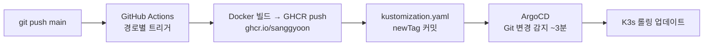
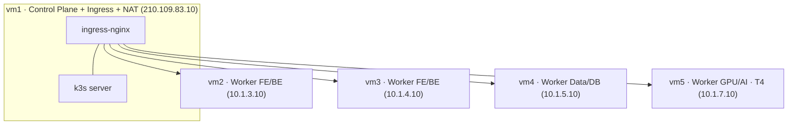

# DevOps (인프라·CI/CD·운영)

KakaoCloud VM 5대 위 **K3s** 클러스터를 **Ansible(프로비저닝) + ArgoCD(GitOps)** 로 운영한다.

## CI/CD 파이프라인



- **CI (GitHub Actions)** — `deploy-4k-fe.yml` / `deploy-4k-be.yml` / `deploy-4k-ml.yml`.
  경로 변경(`4K_FE/**` 등)으로 트리거 → 이미지 빌드·GHCR push → `kustomization.yaml` 태그 커밋(`[skip ci]`).
- **CD (ArgoCD)** — Git을 단일 진실원으로 변경 감지 후 동기화. Kustomize로 매니페스트 관리.
- **FE 빌드 주의** — `NEXT_PUBLIC_*`(Supabase URL/anon, agami 사이트키)는 **빌드타임 baked**.
  사이트키는 워크플로 `build-args`, 서버 시크릿(`AGAMI_SECRET` 등)은 K8s Secret 런타임 주입.

## ArgoCD 애플리케이션 (GitOps 단위)

`Ansible/manifests/argocd/`:

| App | 내용 |
|---|---|
| `infra` | ingress-nginx, cert-manager, 모니터링 등 기반 |
| `4k-fe` / `4k-be` / `4k-ml` | 앱 워크로드(Deployment/Workflow/KServe) |
| `supabase-data` / `supabase-ai` | Supabase 2종(Helm) |
| `argo-workflows` | ML 오케스트레이션 |
| `understand` | 코드 지식그래프 대시보드 |

## 클러스터 토폴로지



| VM | 역할 | Private IP |
|---|---|---|
| vm1 | Control Plane + Ingress + NAT | 10.1.1.10 (Public 210.109.83.10) |
| vm2 / vm3 | Worker (FE/BE) | 10.1.3.10 / 10.1.4.10 |
| vm4 | Worker (Data/DB) | 10.1.5.10 |
| vm5 | Worker (GPU/AI, Tesla T4) | 10.1.7.10 |

- **K3s v1.30**. 네임스페이스: `fe`, `be`, `data`, `ai`, `argocd`, `monitoring`, `argo` 등.
- **NetworkPolicy** (k3s kube-router)로 네임스페이스 간 트래픽 통제.

## IaC — Ansible

| 경로 | 역할 |
|---|---|
| `Ansible/playbooks/` | K3s 클러스터 프로비저닝/구성 |
| `Ansible/manifests/` | **ArgoCD가 동기화하는 K8s 매니페스트(GitOps 소스)** |
| `Ansible/values/` | Helm values (argocd, argo-workflows, supabase data/ai, redis, prometheus, loki, promtail) |
| `Ansible/helm-values/` | ingress-nginx, longhorn |
| `Ansible/inventory.ini`, `kubeconfig`, `ssh_config` | 접속/인벤토리 |

## 네트워킹 · TLS

- **ingress-nginx** (vm1) — 외부 진입점. rate limit 적용(`/api/visit` 등).
- **cert-manager + Let's Encrypt** — `apps/cluster-issuer.yaml`로 인증서 자동 발급.
- ingress: `apps/ingress-nginx-config.yaml`, `apps/ingress-studio.yaml`, `apps/argo-workflows-ingress.yaml`.

## 데이터 · 스토리지

- **Supabase data / ai** (Helm, ArgoCD 관리) — PostgreSQL + pgvector + PostgREST + Kong.
- **Longhorn**(`helm-values/longhorn.yaml`) / local-path PVC(ml-models 등) — 스토리지.
- 캐싱은 Next.js Data Cache 사용(**Redis 미사용** — `values-redis.yaml`은 미참조 고아 파일).

## 관측성 (Observability)

| 스택 | 용도 | values |
|---|---|---|
| Prometheus + Grafana | 메트릭·대시보드 | `values-prometheus.yaml` |
| Loki + Promtail | 로그 수집/조회 | `values-loki.yaml`, `values-promtail.yaml` |

## 배치 작업

**일일 배치 체인 (KST):** 03:00 자막수집 → 04:00 backfill → 05:00 parse → 06:00 score → 07:00 vector

- **CronJob (BE)** — 자막 수집(KST 03:00 = UTC 18:00), 인기작 backfill(KST 04:00 = UTC 19:00).
- **CronWorkflow (Argo)** — parse(05:00) / score(06:00) / vector(07:00). → [MLOps 문서](mlops.md).

## 빠른 운영 명령어

```bash
export KUBECONFIG=$(pwd)/Ansible/kubeconfig
kubectl get pods -A
kubectl get applications -n argocd            # ArgoCD 동기화 상태
kubectl logs -n fe -l app=frontend --tail=50
kubectl get secret argocd-initial-admin-secret -n argocd -o jsonpath="{.data.password}" | base64 -d; echo
```

## 보안 · 백업

- RLS, 매니저 fail-closed 인증, rate limit 등 → 루트 `readme.md` 보안 요약 / `SECURITY.md`(비공개).
- 백업/DR: 맥미니 단독 이전(`backup/macmini-migration` 브랜치), AWS DR 청사진(`aws/`).
