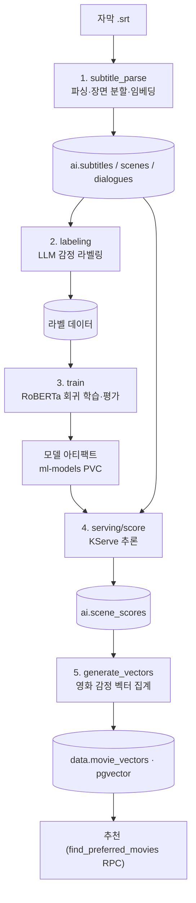

# ML 파이프라인 (4K_ML)

영화 **자막**에서 장면별 감정(arousal/valence) 점수를 산출하고, 이를 **영화 감정 벡터**로 집계해
추천에 사용한다. 코드는 `4K_ML/`, 오케스트레이션은 Argo Workflows(`Ansible/manifests/4k-ml/`).

## 전체 흐름

## 단계별 정리

| # | 단계 | 코드(`4K_ML/`) | 입력 → 출력 | Argo WorkflowTemplate |
|---|---|---|---|---|
| 1 | **subtitle_parse** | `srt.py`, `parse_subtitles.py`, `scenes.py`, `embed.py`, `features.py`, `db.py` | 자막 → `subtitles`/`scenes`/`dialogues` + 임베딩/피처 | `workflowtemplate-subtitle-parse.yaml` |
| 2 | **labeling** | `label_scenes.py`, `batch.py`, `prompt.py`, `db.py` | 장면/대사 → 감정 라벨 | `workflowtemplate-llm-labeling.yaml` |
| 3 | **train** | `dataset.py`, `model.py`, `embed.py`, `features.py`, `evaluate.py` | 라벨 → RoBERTa 회귀 모델 + 평가지표 | `workflowtemplate-train-roberta-seq.yaml`, `-train-roberta.yaml` |
| 4 | **serving/score** | `predictor.py`, `predict_core.py`, `score_scenes.py`, `score_scenes_gpu.py`, `promote.py` | 모델 + 장면 → `scene_scores` | `workflowtemplate-score-scenes.yaml`, `-score-scenes-gpu.yaml` |
| 5 | **generate_vectors** | `generate_vectors.py`, `transform.py`, `db.py` | `scene_scores` → `movie_vectors`(pgvector) | `workflowtemplate-generate-vectors.yaml` |

## 데이터 산출물

| 테이블(DB) | 생성 단계 | 용도 |
|---|---|---|
| `ai.subtitles` / `ai.scenes` / `ai.dialogues` | 1 | 장면·대사 원본 |
| `ai.scene_scores` | 4 | 장면별 감정 점수(타임라인) → **점수 API**·클라이맥스 그래프 |
| `ai.model_versions` | 3·4 | 모델 버전·지표, 활성 버전 |
| `ai.processing_status` | 전체 | 영화별 파이프라인 단계 상태(`subtitle/parse/label/score/vector_state` + retry) |
| `data.movie_vectors` | 5 | 영화 감정 벡터(pgvector) → **추천** |

## 감정 모델

- **RoBERTa 기반 회귀** — 장면 임베딩/피처에서 arousal(긴장도)·valence(정서가) 예측.
- 버전 표기: `<model_version>::arousal`, `<model_version>::valence` (예: `roberta-va-v1::arousal`).
- 평가지표: `spearman_movie_arousal`(영화내 순위 상관), `mae_arousal`.

## 재처리 / 멱등성

- 영화 단위 재처리: 매니저 `POST /api/movies/{tmdb_id}/reprocess` → `processing_status`를 pending으로 리셋.
- 자막 수집 실패는 **7일 쿨다운** 후 재시도(스팸 재시도 방지).
- 단계별 상태(`processing_status`)로 어디까지 처리됐는지 추적·재개.

> 운영/스케줄/서빙은 [MLOps 문서](mlops.md) 참고.
