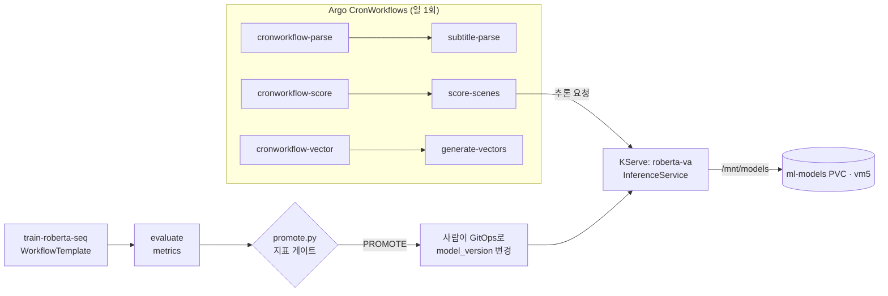
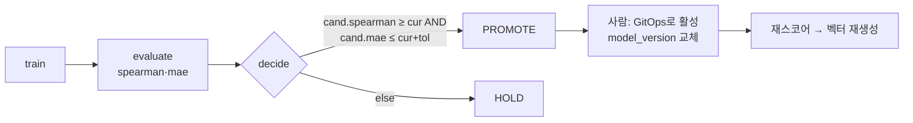

# MLOps (학습·서빙·운영)

ML 파이프라인([ml-pipeline.md](ml-pipeline.md))을 **Argo Workflows로 오케스트레이션**하고, 모델은
**KServe로 서빙**하며, 승격은 지표 게이트 + 사람의 GitOps로 결정한다.

## 오케스트레이션 — Argo Workflows

- **WorkflowTemplate** (재사용 작업 정의): `subtitle-parse`, `llm-labeling`, `train-roberta(-seq)`,
  `score-scenes(-gpu)`, `generate-vectors`.
- **CronWorkflow** (정기 실행, 일 1회 — 이름은 `*-hourly`지만 cron은 daily):

  | 워크플로 | cron(UTC) | KST | 비고 |
  |---|---|---|---|
  | `parse-hourly` → subtitle-parse | `0 20 * * *` | 05:00 | 자막수집(03:00) 뒤 |
  | `score-hourly` → score-scenes | `0 21 * * *` | 06:00 | 파싱 1시간 뒤 |
  | `vector-hourly` → generate-vectors | `0 22 * * *` | 07:00 | 스코어 1시간 뒤 |

  > 일일 배치 체인(KST): 03:00 자막수집 → 04:00 backfill → **05:00 parse → 06:00 score → 07:00 vector**.
- ArgoCD 앱 `argo-workflows`로 설치, RBAC `argo-workflow-rbac-ai.yaml`, UI는 `argo-workflows-ingress.yaml`.
- 매니페스트: `Ansible/manifests/4k-ml/`.

## 서빙 — KServe

`inferenceservice-roberta-va.yaml`:

| 항목 | 값 |
|---|---|
| 종류 | `InferenceService` (RawDeployment) |
| 이름 | `roberta-va` |
| 컨테이너 | custom predictor (torch CPU 추론) |
| 모델 위치 | `ml-models` PVC(`pvc-models.yaml`)를 `/mnt/models`로 직접 마운트 (`MODEL_DIR`) |
| 노드 배치 | `workload: gpu` 라벨로 **vm5 고정**(PVC가 vm5 local-path). GPU 자원은 요청 안 함(CPU 추론) |
| 스레드 | `OMP_NUM_THREADS`/`MKL_NUM_THREADS`로 CPU 스레드 튜닝 |
| 시크릿 | `4k-ml-secrets` |

> GPU 점수 산출이 필요한 경로는 `score-scenes-gpu` WorkflowTemplate / `score_scenes_gpu.py` 별도.

## 모델 수명주기 & 승격 게이트

- **승격 판정** (`serving/promote.py`): candidate가 current 대비
  `spearman_movie_arousal ≥` **그리고** `mae_arousal ≤ current + tol(기본 0.02)` 이면 PROMOTE, 아니면 HOLD.
- **서빙 변경은 자동이 아니라 사람이 GitOps로** 수행(안전장치). 활성 버전은 `app_config`/`model_versions`로 관리.
- 새 모델 적용 후: `score-scenes` 재실행 → `scene_scores` 갱신 → `generate-vectors`로 `movie_vectors` 재생성.
- 롤아웃 기록: [`docs/roberta-va-v2-rollout.md`](roberta-va-v2-rollout.md).

## 상태 추적 & 재처리

- `processing_status`(ai): 영화별 `subtitle/parse/label/score/vector_state` + `retry_count` + `error`.
- 매니저 `reprocess` → 상태 pending 리셋 후 파이프라인 재진입.
- 자막 실패 재시도 **7일 쿨다운**.

## 스토리지/시크릿

| 리소스 | 용도 |
|---|---|
| `ml-models` PVC | 모델 아티팩트(vm5 local-path) |
| `4k-ml-secrets` | DB/추론 시크릿 |

> 클러스터·CI/CD·모니터링 등 일반 운영은 [DevOps 문서](devops.md) 참고.
